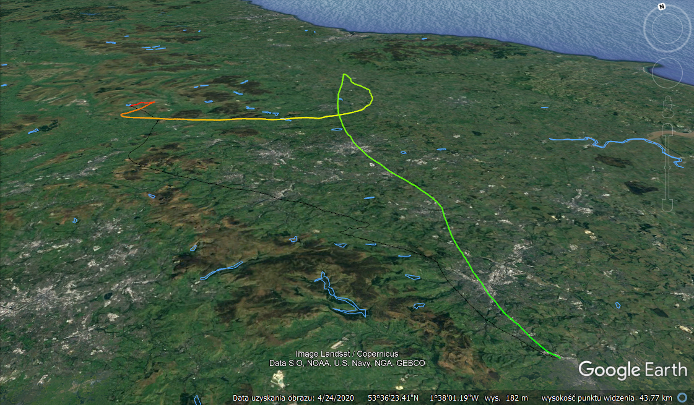
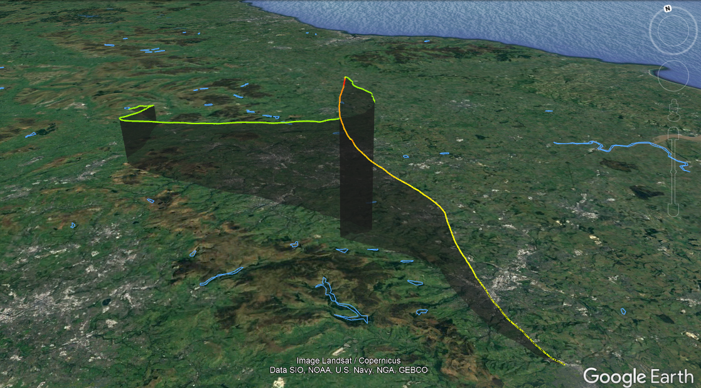
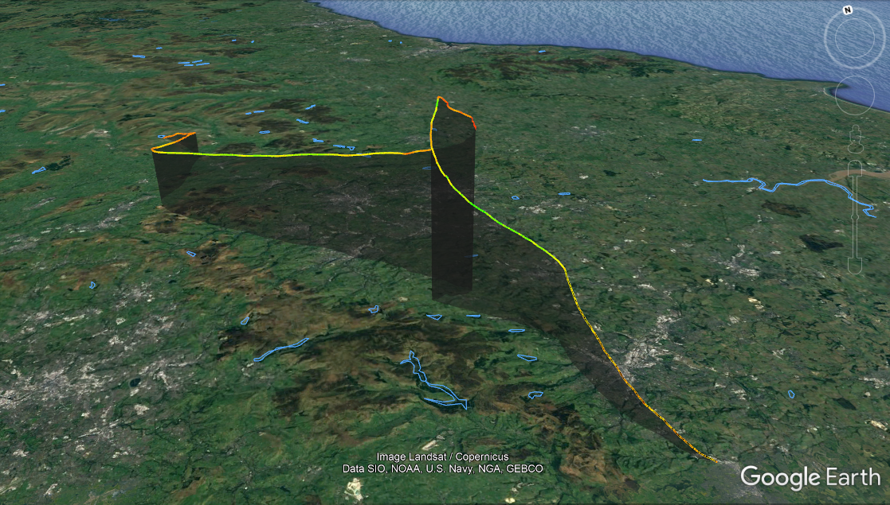
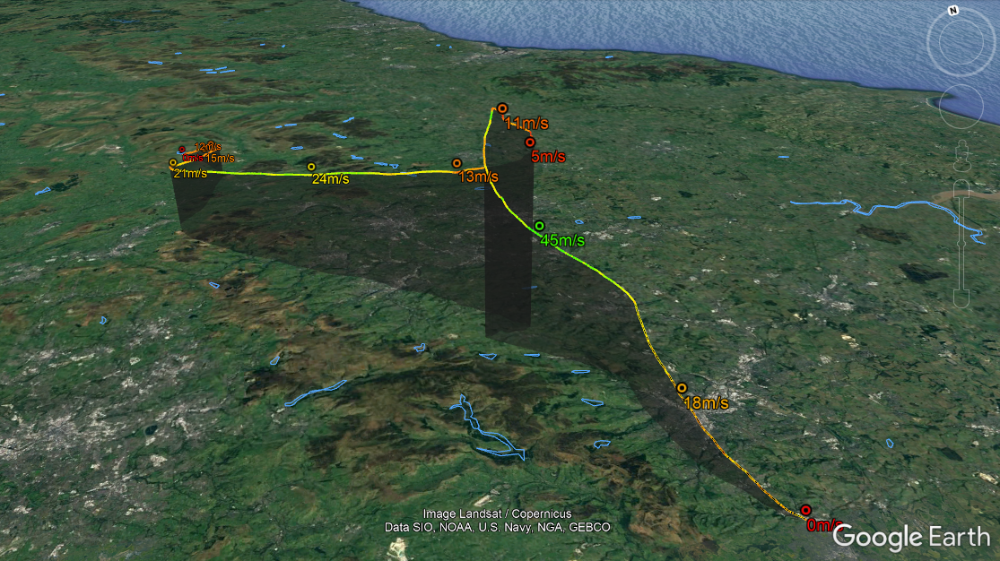
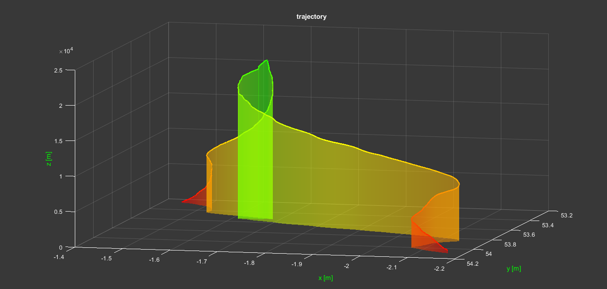
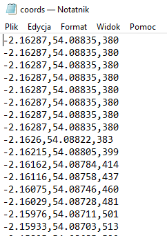
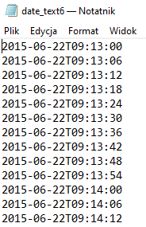

# VISUALIZATION OF FLIGHT TRAJECTORY IN GOOGLE EARTH PRO AND MATLAB

Colored by altitude

Colored by time with normal shadow

Colored by climb with extruded shadow

Colored by speed with extruded shadow

Colored by speed with speed marks (there are also altitude, time and climb marks to choose)

The same trajectory generated in MATLAB colored by altitude

INPUT DATA

If you are using custom or arduino based gps logger insert to your folder file named "GPS.txt" that has NMEA-0183 GPGGA logs.

or

If you have already processed data, create "coords.txt" file and insert rows of longitude,latitude,altitude (no spaces, coordinates in Decimal Degree format and altitude in meters).
Example:

Then you can use file_format_conversion.m program to create "coords2.MAT" file that contains "wspolrzedne" variable which you will need later.

Next you have to create "date_text6.txt" file that contains time stamp of every coordinate. Insert rows of yyyy-mm-ddThh:mm:ss 
Example:

Use "file_format_conversion_data.m" program to create "date.MAT" file that contains "data" variable.

Run "Google_Earth_Matlab_generator.m" that will generate "GE_Path.kml" in your folder.
Run "MATLAB_trajectory.m" that will generate 3D plot of your trajectory and also "trajectory.mp4" file in your folder where plot is smoothly spinning. You can tweak some variables to change the camera angle and rotation speed.  
